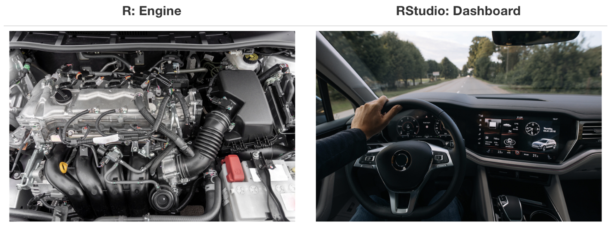

## Scan me for the slides!

{fig-align="center" width="200"}

## What is R?



## What is RStudio?

RStudio is an integrated development environment (IDE) for R and [Python](https://www.python.org) designed to help you be more productive in your daily data science work.

## Why R and RStudio?

1. Open-source and freely available.🔓
2. Backed by strong global community.🌐
3. Widely used in academia.🏫
4. Enable dynamic documents with [Quarto](https://quarto.org).📑
5. Support [reproducible research](https://englianhu.wordpress.com/wp-content/uploads/2016/01/reproducible-research-with-r-and-studio-2nd-edition.pdf) and teaching.🔭

## What are we going to do?

1. Install [R](https://posit.co/download/rstudio-desktop/).
2. Install [RStudio](https://posit.co/download/rstudio-desktop/).
3. Lets get our hands dirty with R and [RStudio](https://docs.posit.co/ide/user/).👨🏽‍💻
4. Install packages and other tools: [Quarto](https://quarto.org/docs/get-started/), `rmarkdown`, `tinytex` with `quarto install tinytex`, and [Git](https://git-scm.com).
5. Resources in learning R.📚

## Installing R and RStudio



## Installing `rmarkdown` and `tinytex`



## Installing Quarto



## Installing Git



## Resources

1. [Big Book of R](https://www.bigbookofr.com/010-start_here)
2. [RUG](https://www.meetup.com/pro/r-user-groups/) or [RLadies](https://www.meetup.com/pro/rladies/) Meetups
3. [fosstodon](https://fosstodon.org/@mildorville) 

# Thank You!!! {background-image="pics/rnvsu.jpeg" background-opacity="0.3"}